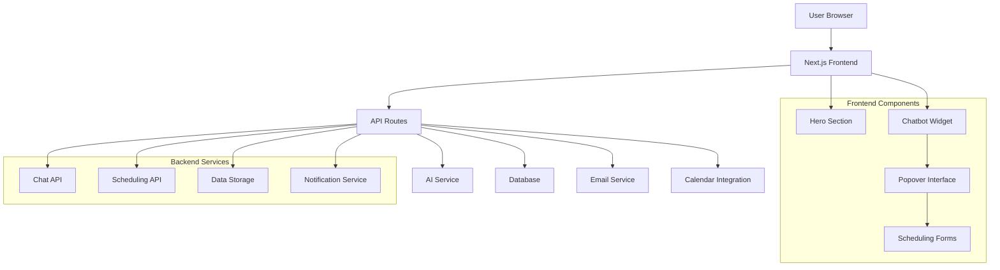

# Design Document

## Overview

The ETIC AI Chatbot system is a modern Next.js web application that combines an attractive landing page with an intelligent conversational interface. The system serves as the digital front door for ETIC Algarve, providing prospective students with immediate access to school information and seamless pathways to engagement through interviews, tours, and calls.

The design emphasizes user experience, performance, and conversion optimization while maintaining a non-invasive approach to lead generation. The system leverages modern web technologies and AI capabilities to create a sophisticated yet approachable interface.

## Architecture

### High-Level Architecture



### Technology Stack

- **Frontend**: Next.js 15+ with App Router, React 19+, TypeScript
- **Styling**: Tailwind CSS for responsive design and component styling
- **UI Components**: ShadCN UI for pre-built, accessible components built on Radix UI
- **Chatbot Components**: ShadCN Chatbot Kit for specialized chat interface components
- **Component Library**: Radix UI primitives as the foundation for ShadCN components
- **State Management**: React Context API and useState/useReducer for local state
- **Form Handling**: React Hook Form with Zod validation (integrated with ShadCN forms)
- **AI Integration**: Vercel AI SDK with Google Gemini 2.5 Flash for conversational capabilities
- **Database**: PostgreSQL with Prisma ORM for data persistence
- **Deployment**: Vercel for optimal Next.js hosting and performance
- **Icons**: Lucide React (default with ShadCN UI)
- **Animations**: Framer Motion for advanced animations, CSS transitions for simple ones

### Component Installation Strategy

**Core ShadCN UI Components**:

```bash
# Initialize ShadCN UI
npx shadcn@latest init

# Install essential components
npx shadcn@latest add button card input label textarea select
npx shadcn@latest add form calendar dialog popover badge avatar
npx shadcn@latest add alert tooltip separator tabs radio-group
npx shadcn@latest add checkbox switch slider progress
```

**ShadCN Chatbot Kit Components**:

```bash
# Install complete chat interface
npx shadcn@latest add https://shadcn-chatbot-kit.vercel.app/r/chat.json

# Install individual chat components
npx shadcn@latest add https://shadcn-chatbot-kit.vercel.app/r/message-list.json
npx shadcn@latest add https://shadcn-chatbot-kit.vercel.app/r/message-input.json
npx shadcn@latest add https://shadcn-chatbot-kit.vercel.app/r/chat-message.json
npx shadcn@latest add https://shadcn-chatbot-kit.vercel.app/r/typing-indicator.json
npx shadcn@latest add https://shadcn-chatbot-kit.vercel.app/r/prompt-suggestions.json
npx shadcn@latest add https://shadcn-chatbot-kit.vercel.app/r/copy-button.json
npx shadcn@latest add https://shadcn-chatbot-kit.vercel.app/r/markdown-renderer.json
```

**Additional Dependencies**:

```bash
# AI SDK and related packages
npm install ai @ai-sdk/google

# Chatbot Kit dependencies
npm install framer-motion@11 remeda@2 react-markdown remark-gfm shiki

# Date handling for calendar
npm install date-fns

# Additional utilities
npm install class-variance-authority clsx tailwind-merge lucide-react
```

## Components and Interfaces

### 1. Hero Section Component

**Purpose**: Create an impactful first impression with ETIC AI branding

**Key Features**:

- Prominent "ETIC AI" branding with modern typography
- Subtle animations and micro-interactions
- Clear value proposition messaging
- Call-to-action to engage with the chatbot using ShadCN Button component
- Responsive design across all device sizes

**ShadCN Components Used**:

- `Button` for call-to-action elements
- `Badge` for feature highlights or status indicators
- `Card` for content sections if needed
- Custom typography using Tailwind classes

**Technical Implementation**:

- Server-side rendered for optimal SEO
- Optimized images with Next.js Image component
- ShadCN Button variants for different action types
- Framer Motion for entrance animations
- Intersection Observer for scroll-triggered animations

### 2. Chatbot Widget Component

**Purpose**: Provide persistent access to the AI assistant with portable embedding capabilities

**Key Features**:

- Small, visible chat icon positioned at bottom of screen
- Notification badge for new messages or prompts
- Smooth open/close animations
- Accessibility compliance (ARIA labels, keyboard navigation)
- Mobile-optimized positioning
- Embeddable widget for external websites
- Cross-domain compatibility
- Style isolation to prevent conflicts

**ShadCN Components Used**:

- `Button` with floating variant for the widget trigger
- `Badge` for notification indicators
- `Popover` or `Dialog` for the chat interface container
- `Avatar` for chat participants
- `Tooltip` for helpful hints and guidance

**Technical Implementation**:

- Fixed positioning with z-index management
- ShadCN Button with custom floating styles
- Framer Motion for smooth open/close animations
- Event listeners for click and keyboard interactions
- Local storage for widget state persistence
- Shadow DOM encapsulation for style isolation
- PostMessage API for cross-origin communication
- Standalone JavaScript bundle with ShadCN components
- CSS variables for theme customization in embedded mode

### 3. Popover Chat Interface

**Purpose**: Main conversational interface for user interactions

**Key Features**:

- Clean, modern chat UI with message bubbles (sized for good usability, not full screen)
- Typing indicators and message status
- Scroll management for long conversations
- Message history persistence during session
- Three-button action interface at message end

**ShadCN Components Used**:

- `Dialog` or `Popover` for the main chat container
- ShadCN Chatbot Kit `Chat` component for complete chat interface
- `MessageList` component for displaying conversation history
- `MessageInput` component with file attachment support
- `TypingIndicator` for showing AI response loading
- `PromptSuggestions` for initial conversation starters
- `CopyButton` for copying AI responses

**Technical Implementation**:

- Portal rendering using ShadCN Dialog/Popover primitives
- ShadCN Chatbot Kit integration with Vercel AI SDK
- Built-in scroll management and virtual scrolling
- Real-time message streaming with `useChat` hook
- File attachment support with drag-and-drop
- Voice input capabilities with audio transcription

### 4. Scheduling Components

**Purpose**: Convert conversations into actionable scheduling requests

**Components**:

#### Interview Form

- Personal information fields (name, email, phone)
- Program of interest selection
- Preferred interview format (in-person, video, phone)
- Additional notes textarea
- Form validation and error handling

#### Tour Calendar

- Calendar widget with available dates
- Time slot selection
- Group size specification
- Special requirements field
- Confirmation and reminder system

#### Call Scheduler

- Date picker for preferred call date
- Time preference selection (morning/afternoon)
- Contact information collection
- Call purpose specification
- Timezone handling for international students

**ShadCN Components Used**:

- `Form` with React Hook Form integration
- `Input` for text fields
- `Select` for dropdown selections
- `Textarea` for additional notes
- `Calendar` for date selection
- `Button` for form actions
- `Card` for form containers
- `Label` for form field labels
- `RadioGroup` for time preferences
- `Checkbox` for additional options
- `Alert` for validation messages

**Technical Implementation**:

- ShadCN Form components with React Hook Form integration
- Zod schema validation (built into ShadCN forms)
- ShadCN Calendar component with date-fns
- Built-in form validation and error handling
- Loading states with ShadCN Button variants
- Responsive form layouts with ShadCN Card components

## Data Models

### User Session

```typescript
interface UserSession {
  id: string;
  sessionId: string;
  ipAddress: string;
  userAgent: string;
  startTime: Date;
  lastActivity: Date;
  conversationHistory: Message[];
}
```

### Message

```typescript
interface Message {
  id: string;
  sessionId: string;
  role: "user" | "assistant";
  content: string;
  timestamp: Date;
  metadata?: {
    intent?: string;
    confidence?: number;
    actionButtons?: ActionButton[];
  };
}
```

### Scheduling Request

```typescript
interface SchedulingRequest {
  id: string;
  sessionId: string;
  type: "interview" | "tour" | "call";
  status: "pending" | "confirmed" | "completed" | "cancelled";
  contactInfo: {
    name: string;
    email: string;
    phone?: string;
  };
  preferences: {
    date?: Date;
    timePreference?: "morning" | "afternoon" | "specific";
    specificTime?: string;
    format?: "in-person" | "video" | "phone";
    programInterest?: string;
    notes?: string;
  };
  createdAt: Date;
  updatedAt: Date;
}
```

### ETIC Program Data

```typescript
interface Program {
  id: string;
  name: string;
  category: string;
  duration: string;
  description: string;
  requirements: string[];
  careerOutcomes: string[];
  schedule: {
    format: "full-time" | "part-time" | "evening";
    duration: string;
  };
  isActive: boolean;
}
```

## Error Handling

### Frontend Error Boundaries

- React Error Boundaries for component-level error catching
- Graceful degradation when chatbot service is unavailable
- User-friendly error messages with retry options
- Fallback UI for critical component failures

### API Error Handling

- Structured error responses with appropriate HTTP status codes
- Rate limiting protection with user feedback
- Timeout handling for AI service calls
- Retry logic with exponential backoff

### User Experience Error Handling

- Form validation with real-time feedback
- Network connectivity detection and offline messaging
- Loading states for all async operations
- Clear error messages with actionable next steps

## Testing Strategy

### Unit Testing

- Component testing with React Testing Library
- Utility function testing with Jest
- Form validation testing
- API route testing with mock data

### Integration Testing

- End-to-end conversation flows
- Scheduling workflow testing
- Database integration testing
- AI service integration testing

### Performance Testing

- Core Web Vitals monitoring
- Chatbot response time testing
- Database query performance
- Mobile device performance testing

### Accessibility Testing

- Screen reader compatibility
- Keyboard navigation testing
- Color contrast validation
- ARIA attribute verification

### User Acceptance Testing

- Conversation flow testing with real users
- Scheduling process usability testing
- Mobile experience validation
- Cross-browser compatibility testing

## AI Integration Architecture

### Vercel AI SDK Integration

**Chat Implementation**:

```typescript
// Basic chat setup with useChat hook
"use client";

import { useChat } from "ai/react";
import { Chat } from "@/components/ui/chat";

export function EticAIChatbot() {
  const {
    messages,
    input,
    handleInputChange,
    handleSubmit,
    isLoading,
    stop,
    append,
  } = useChat({
    api: "/api/chat",
    systemMessage: `You are ETIC AI, a helpful assistant for ETIC Algarve school...`,
  });

  return (
    <Chat
      messages={messages}
      input={input}
      handleInputChange={handleInputChange}
      handleSubmit={handleSubmit}
      isGenerating={isLoading}
      stop={stop}
      append={append}
      suggestions={[
        "Tell me about ETIC Algarve programs",
        "How can I schedule an interview?",
        "What courses do you offer?",
      ]}
    />
  );
}
```

**API Route Implementation**:

```typescript
// app/api/chat/route.ts
import { google } from "@ai-sdk/google";
import { streamText } from "ai";

export async function POST(req: Request) {
  const { messages } = await req.json();

  const result = await streamText({
    model: google("gemini-2.0-flash-exp"),
    messages,
    system: `You are ETIC AI, a knowledgeable assistant for ETIC Algarve school...`,
    tools: {
      scheduleInterview: {
        description: "Schedule an interview for a prospective student",
        parameters: z.object({
          studentName: z.string(),
          email: z.string(),
          program: z.string(),
        }),
      },
      scheduleTour: {
        description: "Schedule a campus tour",
        parameters: z.object({
          date: z.string(),
          groupSize: z.number(),
        }),
      },
    },
  });

  return result.toAIStreamResponse();
}
```

### System Prompt Design

The AI system prompt will include:

- ETIC Algarve school information and programs
- Non-invasive conversation guidelines
- Scheduling flow instructions
- Fallback responses for unknown information
- Tone and personality guidelines

## Security Considerations

### Data Protection

- GDPR compliance for EU users
- Data encryption at rest and in transit
- Session management with secure tokens
- PII handling and retention policies

### API Security

- Rate limiting on all endpoints
- Input validation and sanitization
- CORS configuration for frontend-only access
- API key management for AI services

### User Privacy

- Cookie consent management
- Analytics data anonymization
- Conversation data retention policies
- User data deletion capabilities

## Performance Optimization

### Frontend Optimization

- Code splitting with Next.js dynamic imports
- Image optimization with Next.js Image component
- CSS optimization with Tailwind CSS purging
- Bundle analysis and optimization

### Backend Optimization

- Database query optimization with proper indexing
- Caching strategies for frequently accessed data
- AI response caching for common queries
- CDN integration for static assets

### Monitoring and Analytics

- Real-time performance monitoring
- User interaction analytics
- Conversion funnel tracking
- Error tracking and alerting

## Embeddable Widget Architecture

### Widget Distribution

**Purpose**: Enable the chatbot to be embedded on external websites

**Key Components**:

#### Widget Loader Script

- Lightweight JavaScript loader (~5KB gzipped)
- Asynchronous loading to prevent blocking host page
- Configuration options for customization
- Version management and automatic updates

#### Widget Bundle

- Self-contained React application
- Shadow DOM encapsulation for style isolation
- PostMessage communication with parent window
- Responsive design that adapts to container

#### Integration API

```javascript
// Simple integration example
<script>
  window.EticAI = {
    config: {
      apiKey: 'your-api-key',
      theme: 'light',
      position: 'bottom-right',
      primaryColor: '#your-brand-color'
    }
  };
</script>
<script src="https://widget.etic-ai.com/embed.js" async></script>
```

**Technical Implementation**:

- Webpack configuration for standalone bundle
- CSS-in-JS for complete style encapsulation
- Cross-origin resource sharing (CORS) configuration
- Content Security Policy (CSP) compliance
- Iframe fallback for maximum compatibility

### Cross-Domain Communication

**Security Considerations**:

- Origin validation for all PostMessage communications
- API key authentication for widget access
- Rate limiting per domain
- Data encryption for sensitive information

**Performance Optimization**:

- Lazy loading of widget components
- CDN distribution for global performance
- Caching strategies for widget assets
- Minimal DOM manipulation on host page

## Deployment and Infrastructure

### Development Environment

- Local development with Docker containers
- Environment variable management
- Hot reloading for rapid development
- Database seeding for consistent testing

### Production Deployment

- Vercel deployment with automatic CI/CD
- Environment-specific configuration
- Database migrations and backups
- SSL certificate management

### Monitoring and Maintenance

- Application performance monitoring
- Database health monitoring
- AI service availability monitoring
- Automated backup and recovery procedures
